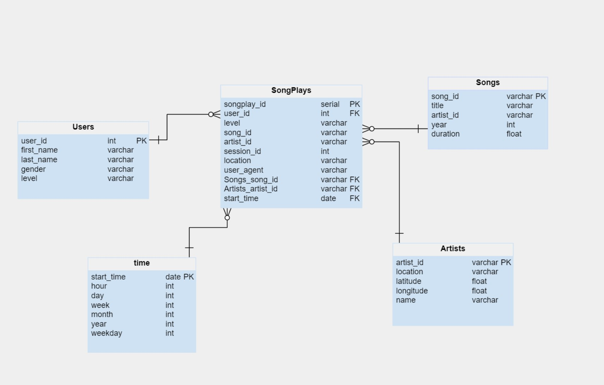

# Data modeling with Postgres:

In this project, we will apply what we've applied to data modeling with Postgres and build an ETL pipeline using Python. To complete this project, we will need to define fact and dimension tables for a star schema for a particular analytic focus, and write an ETL pipeline that transfers data from files in two local directories into these tables in Postgres by Python and SQL.

> **This project is a part of [Data Engineering Nanodegree](https://www.udacity.com/course/data-engineer-nanodegree--nd027)**

# Files Descriptions:

•	`Data folder`: it is at the home page of the project, which includes all JSONS files.

•	`Sql_queries.py`: includes all of our SQL queries.

•	`Create_tables.py`: include creates, Inserts, drops tables. we should be running this file to reset our tables before running ETL scripts.

•	`Test.ipynb`:  this notebook runs our SQL queries to confirm our records were successfully inserted into each table.

•	`Etl.ipynb`:  notebook to develop ETL processes for each table, in this notebook we read files from `song_data and log_data`, then load it into our tables.

•	`Etl.py`:  we used `etl.ipynb` notebook  to complete etl.py to process the entire datasets.

•	README.md : includes a summary of our project.

# Star Schema design:

In this project, we used the Star Schema, which is a subset of "fact and dimension tables". Fact Table is SongPlays and  Dimension Tables are Users, Songs, Artists, and Time.
The Star Schema includes one *fact* table (`SongPlays`), and 4 *dimension* tables (`Users`, `Songs`, `Artists`, `Time`)

We used Star Schema in our dataset to denormalized and allowing for simpler queries and quicker aggregations. furthermore, that will help Data Scientists to be able to easily query this dataset and acquiring insights about what songs, artists, and what audiences prefer listening to.

Also, there is no doubt, denormalized data does have drawbacks. 
which means of decrease in data integrity and query flexibility.

# Steps to run this project: 

- Run `create_tables.py` to create our database and tables.
- Run `etl.py` on the terminal to process and load data into the database.
- Run `test.ipynb` to confirm the creation of our tables with the correct columns. 
> **Make sure to click "Restart kernel" to close the connection to the database after running this notebook**.

